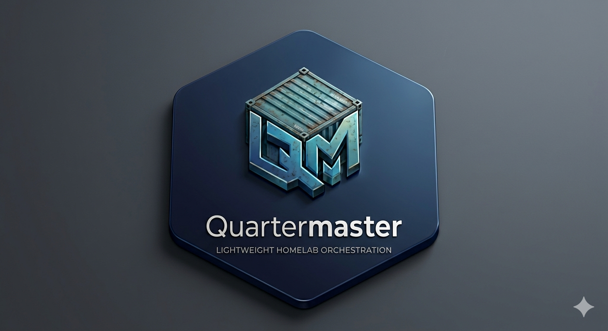

# Quartermaster

<p align="center">
  
</p>

Lightweight, single-node container orchestrator for homelabs.

Quartermaster reconciles a YAML manifest against a [containerd](https://containerd.io)
runtime — no Kubernetes, no Docker, no daemon overhead beyond what you explicitly
configure. Designed for Debian.

## Quick start

```bash
# Build
make build

# Write a stack
cat > stack.yaml <<EOF
version: "1"
kind: Stack
metadata:
  name: my-homelab
spec:
  services:
    - name: nginx
      image: docker.io/library/nginx:alpine
      network: internal
      ports:
        - host: 8080
          container: 80
      healthcheck:
        type: http
        path: /
        port: 80
        interval: 30s
EOF

# Run the daemon (requires containerd)
sudo bin/qm-daemon --stack stack.yaml

# Check status
qm status
```

## CLI

```
qm validate <file>    Check a stack file for errors
qm status             Show daemon and container status
qm service logs <n>   Show container logs
qm service restart <n> Stop and redeploy a service
qm secret create <n>  Create an encrypted secret (reads from stdin)
qm secret list        List stored secrets
```

## Stack format

```yaml
version: "1"
kind: Stack
metadata:
  name: example
spec:
  services:
    - name: app
      image: docker.io/library/nginx:alpine
      restart_policy: always
      network: internal          # public | internal | vpn | host
      ports:
        - host: 8080
          container: 80
      volumes:
        - source: /srv/www
          target: /usr/share/nginx/html
          type: bind
      env:
        - name: TZ
          value: "UTC"
      secrets:
        - name: api-key
          secret_ref: my-api-key
      user: "1000:1000"
      depends_on: [other-service]
      healthcheck:
        type: http
        path: /health
        port: 80
        interval: 30s
      command: ["/entrypoint.sh"]
```

## Networking

Three network profiles:

| Profile   | Namespace | Egress          | Ingress              |
|-----------|-----------|-----------------|----------------------|
| `public`  | Host      | Direct          | Router / Tailscale   |
| `host`    | Host      | Direct          | Router / Tailscale   |
| `internal`| Bridge    | Via `qm0` NAT   | Host via DNAT        |
| `vpn`     | Bridge    | Via VPN gateway | Internal zone only   |

Containers on the bridge (`internal`, `vpn`) get IPs from `10.42.0.0/24` and DNS from the in-process forwarder on `10.42.0.1:53`.

## Security

- **Secrets at rest**: NaCl secretbox (XSalsa20-Poly1305), master key at `/etc/quartermaster/master.key`
- **Secrets at runtime**: Mounted as read-only files on tmpfs — never environment variables
- **Least privilege**: Daemon runs as dedicated `quartermaster` system user with `CAP_NET_ADMIN`, `CAP_SYS_ADMIN`, `CAP_DAC_OVERRIDE`
- **Containers**: Run as non-root when `user:` is specified

```bash
echo "my-token" | qm secret create api-token
```

Referenced in the stack as:

```yaml
secrets:
  - name: api-token
    secret_ref: api-token
```

The file appears at `/run/secrets/api-token` inside the container.

## Requirements

- Debian (trixie or later recommended)
- [containerd](https://containerd.io) 1.7+
- Go 1.25+ (to build)

## Install

```bash
sudo make install
sudo systemctl enable --now qm-daemon
```

The daemon reads `/etc/quartermaster/stack.yaml` by default. Override with `--stack` or `QM_STACK_FILE`.

## Components

Reusable stack definitions (reverse proxy, VPN, monitoring, media servers) live in
the [quartermaster-components](https://github.com/Camfel/quartermaster-components)
repo.  Enable them with:

```bash
qm components list          # browse available components
qm enable caddy             # reverse proxy with auto-TLS
qm enable vpn               # VPN gateway via Gluetun
qm enable grafana           # metrics dashboards
```

See the [components repo](https://github.com/Camfel/quartermaster-components) for
the full catalog, usage guides, and example configurations.

## GitOps

Quartermaster can pull stacks from a git repo instead of a local file.  SSH deploy
keys are the recommended authentication method:

```bash
# One-time setup
gh auth login
./scripts/setup-deploy-key.sh --repo you/your-stacks

# Paste the printed snippet into /etc/quartermaster/settings.json
```

The script generates an Ed25519 key pair, registers it as a GitHub deploy key,
seeds `known_hosts`, and prints the exact config block to add to your settings.
Run `./scripts/setup-deploy-key.sh --help` for all options.

## Development

```bash
make all             # fmt + vet + test + build (CI gate)
make check           # fast pre-commit: fmt + vet only
make test            # unit tests
make test-race       # unit tests with race detector
make integration-test # integration tests (requires containerd)
make clean           # remove build artifacts
```

Integration tests require a running containerd.  The CI pipeline (`make all`)
runs unit tests only — integration tests are local-only for now.

## License

Apache 2.0 — see [LICENSE](LICENSE).
